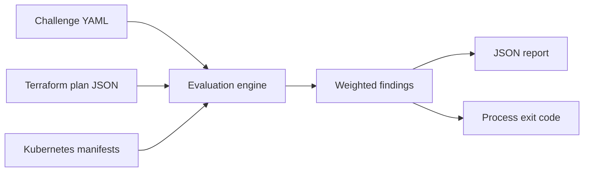

# Architecture

Infrastructure Challenge Forge separates author intent from candidate
implementation:

## Design decisions

### Evaluate plans, not source text

Terraform source can express the same infrastructure through modules, loops,
locals, and data sources. Scanning HCL text rewards a specific coding style and
is easy to evade. The engine inspects Terraform's normalized plan JSON instead.
This makes rules module-agnostic and closer to the infrastructure AWS will
receive.

### Deterministic before live-cloud

The core evaluator runs without AWS credentials and uses committed plan fixtures
for regression tests. A challenge author can add a live deployment stage, but
credential-free scoring keeps pull requests fast, reproducible, and safe.

### Evidence on every finding

A score alone is not useful during incident recovery. Every rule returns compact
evidence, such as the missing control-plane log types or the number of NAT
gateways compared with private availability zones.

### Fail closed

Unknown rule types, invalid rubric weights, duplicate IDs, and malformed input
stop evaluation. Missing resources fail their associated controls instead of
silently passing.

## Trust boundaries

The evaluator treats plans and manifests as untrusted input. It does not execute
candidate Terraform, shell hooks, provisioners, or container images. Production
deployment should happen in a short-lived AWS account behind a separate approval
boundary.

